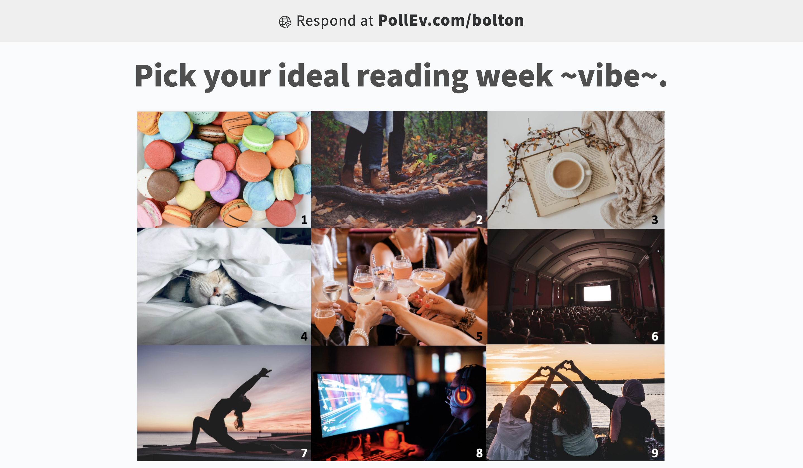

```{r setup, include=FALSE}
# R options
options(
  htmltools.dir.version = FALSE, # for blogdown
  show.signif.stars = FALSE,     # for regression output
  warm = 1,
  crayon.enabled = FALSE
  )
# Set dpi and height for images
library(knitr)
opts_chunk$set(fig.height = 2.65, dpi =300, warning=FALSE, message=FALSE) 
# ggplot2 color palette with gray
color_palette <- list(gray = "#999999", 
                      salmon = "#E69F00", 
                      lightblue = "#56B4E9", 
                      green = "#009E73", 
                      yellow = "#F0E442", 
                      darkblue = "#0072B2", 
                      red = "#D55E00", 
                      purple = "#CC79A7")

library(tidyverse)
library(gridExtra)
htmltools::tagList(rmarkdown::html_dependency_font_awesome())
### xaringan::inf_mr() -> use this for display within Rstudio

xaringanExtra::use_share_again()
xaringanExtra::style_share_again(
  share_buttons = "none"
)

htmltools::tagList(
  xaringanExtra::use_clipboard(
    button_text = "<i class=\"fa fa-clipboard\"></i>",
    success_text = "<i class=\"fa fa-check\" style=\"color: #90BE6D\"></i>",
    error_text = "<i class=\"fa fa-times-circle\" style=\"color: #F94144\"></i>"
  ),
  rmarkdown::html_dependency_font_awesome()
)
```


class: middle, center, inverse
name: welcome
# Welcome

.header[<u>[Go to plan](#plan)</u>]

---

# Land Acknowledgement

Though we are meeting together online, let us begin by acknowledging the land that brings us together as members of the U of T community. The land on which our University operates is the traditional lands of the Anishinaabe, the Haudenosaunee and the Mississaugas of the Credit. With the Dish With One Spoon treaty, these peoples agreed to share and protect this land, and all those who have come here since, both Indigenous and non-Indigenous, are invited into this treaty in a spirit of respect and peace. I also seek to acknowledge that this is, more recently, Treaty 13 land, a treaty between the Mississaugas and the British Crown.

Today we come together to discuss statistics and human biology, two fields that have been part of historical and ongoing colonization,  oppression and harm of Indigenous peoples. Let us take this moment to remind ourselves of our responsibilities to this land, its original peoples, and to each other and work to be ethical and culturally competent practitioners in our chosen fields.

.small[It is [#TreatiesRecognitionWeek](https://twitter.com/hashtag/TreatiesRecognitionWeek?src=hashtag_click), you can learn more about the indigenous history of Tkaronto with this [U of T library guide](https://guides.library.utoronto.ca/Toronto).]

---

## Check-in

```{r, fig.align='center', echo=FALSE}

```

---
name: plan

## Plan for today
You can click the following links to navigate through the slides (in the HTML version).

* [Welcome](#welcome)
* [Goals](#goals)
* [Introductions](#breakout0)
* [Case study](#fish)
* [Breakout 1](#breakout1)
* [Report back 1](#report1)
* [10 minute break](#break)
* [Breakout 2](#breakout2)
* [Report back 2](#report2)
* [Ticket out the door](#ticket)
* [Closing](#close)

---
class: middle, center, inverse
name: goals
# Goals

.header[<u>[Go to plan](#plan)</u>]
---

## Learning outcomes

.header[<u>[Go to plan](#plan)</u>]

.pull-left[
###STA
By the end of this session, STA students will have:

- Practiced active listening
- Practiced asking appropriate questions to elicit information needed for providing statistical advice
- Experienced what a short-term consulting appointment is like
- Practiced providing advice on statistical considerations and methods
]

.pull-right[
### HMB
By the end of this session, HMB students will have:

- Practiced explaining their research to a non-HMB student
- Practiced asking questions to clarify technical advice received
- Increased their exposure to statistical ‘traps’ to look out for in research
]

---
name: breakout0

### Introduction instructions

.header[<u>[Go to plan](#plan)</u>]

.highlight[You have 4 minutes.] 

0. Pay attention to the NUMBER of the room you are invited to join.

1. Please introduce yourselves: 
  - preferred name,  
  - pronouns (optional),  
  one thing you're looking forward to over reading week.

2. Please test that you have access to your microphone (camera encouraged, but optional). .small[If your peer is missing and/or you/they don't have access to a mic, please let us know and we will try to rearrange groups appropriately. (You can use 'Raise Hand')]

3. Have ONE person in your room open the [discussion document](https://utoronto-my.sharepoint.com/:w:/g/personal/liza_bolton_utoronto_ca/EYAcXiL_Le9BhEpLWMiytxMBXWlMVhLPBwMz8-pHSkbLWg?e=pwN278) for today.


---
class: middle, center, inverse
name: fish
background-image: url("images/fmri-salmon.jpeg")
background-size: contain
# Case study

.header[<u>[Go to plan](#plan)</u>]

---
## Methods

.header[<u>[Go to plan](#plan)</u>]

Note: The Subject, Task and Design sections are reproduced from the original poster. The Analysis component has been simplified slightly

__Subject.__ One mature Atlantic Salmon (Salmo salar) participated in the fMRI study.
The salmon was approximately 18 inches long, weighed 3.8 lbs, and was not alive at
the time of scanning.

__Task.__ The task administered to the salmon involved completing an open-ended
mentalizing task. The salmon was shown a series of photographs depicting human
individuals in social situations with a specified emotional valence. The salmon was
asked to determine what emotion the individual in the photo must have been
experiencing.

__Design.__ Stimuli were presented in a block design with each photo presented for 10
seconds followed by 12 seconds of rest. A total of 15 photos were displayed. Total
scan time was 5.5 minutes.

.small[Source: http://prefrontal.org/files/posters/Bennett-Salmon-2009.pdf]

---
## Analysis

.header[<u>[Go to plan](#plan)</u>]

Suppose tests (t-contrasts) were conducted on whether there were regions of voxels (like a 3D pixel) that changed between the rest condition and when looking at the human face.

"The parameters for this comparison were t(131) > 3.15, p-value < 0.001, 3 voxel extent
threshold."


.small[Source: http://prefrontal.org/files/posters/Bennett-Salmon-2009.pdf]

---
## GLM results (initial)

.header[<u>[Go to plan](#plan)</u>]

"Several active voxels were discovered in a cluster located within the salmon’s
brain cavity. The size of this cluster was 81 mm3 with a
cluster-level significance of p = 0.001. Due to the coarse resolution of the
echo-planar image acquisition and the relatively small size of the salmon
brain further discrimination between brain regions could not be completed.
Out of a search volume of 8064 voxels a total of 16 voxels were significant."

.small[Source: http://prefrontal.org/files/posters/Bennett-Salmon-2009.pdf]

---
.header[<u>[Go to plan](#plan)</u>]

## Results _after_ controlling for the false discovery rate

"Identical t-contrasts controlling the false discovery rate (FDR) and familywise
error rate (FWER) were completed. These contrasts indicated no active
voxels, even at relaxed statistical thresholds (p = 0.25)."

.small[Source: http://prefrontal.org/files/posters/Bennett-Salmon-2009.pdf]

---
# Further reading

.header[<u>[Go to plan](#plan)</u>]

The original poster: http://prefrontal.org/files/posters/Bennett-Salmon-2009.pdf

IgNobel prize win write up: https://blogs.scientificamerican.com/scicurious-brain/ignobel-prize-in-neuroscience-the-dead-salmon-study/

---
class: middle, center, inverse
name: breakout1
# Breakout 1

.header[<u>[Go to plan](#plan)</u>]

---

# Discussion questions

.header[<u>[Go to plan](#plan)</u>]

.highlight[You have 10 minutes.] 

1. Work through the description of the study together identifying the parts you understand, partially understand and are unsure of/not familiar with at all. 

2. What are Type 1 and Type 2 error? How do they relate to the ideas of false discovery rates and family-wise error.

3. Together, come up with how you would explain the problem this study is seeking to emphasize to a human bio researcher who is _not_ familiar with the statistical issues here. 


🔗 [Discussion document](https://utoronto-my.sharepoint.com/:w:/g/personal/liza_bolton_utoronto_ca/EYAcXiL_Le9BhEpLWMiytxMBXWlMVhLPBwMz8-pHSkbLWg?e=pwN278) 

---
class: middle, center, inverse
name: report1
# Report back 1

.header[<u>[Go to plan](#plan)</u>]

---
class: middle, center
name: break
background-image: url("images/stretch.jpg")
# Break time! 10 minutes

.header[<u>[Go to plan](#plan)</u>]

Take a moment to stretch and grab a drink.

.small[Photo by <a href="https://unsplash.com/@arstyy?utm_source=unsplash&utm_medium=referral&utm_content=creditCopyText">Austin Neill</a> on <a href="https://unsplash.com/s/photos/stretch?utm_source=unsplash&utm_medium=referral&utm_content=creditCopyText">Unsplash</a>]
  

---
class: middle, center, inverse
name: breakout2
# Breakout 2

.header[<u>[Go to plan](#plan)</u>]

---
# Instructions

.header[<u>[Go to plan](#plan)</u>]

If you are in groups discussing HMB student research go to [THIS SLIDE](#researchinstructions)

If you are in groups working on a provided case study, go to [THIS SLIDE](#powerpose)

🔗 [Discussion document](https://utoronto-my.sharepoint.com/:w:/g/personal/liza_bolton_utoronto_ca/EYAcXiL_Le9BhEpLWMiytxMBXWlMVhLPBwMz8-pHSkbLWg?e=pwN278) 


---
name: researchinstructions

### Discussion prompts for breakouts discussing HMB student research

.header[<u>[Go to plan](#plan)</u>]

.highlight[You will have 25 minutes for this.] 🔗 [Discussion document](https://utoronto-my.sharepoint.com/:w:/g/personal/liza_bolton_utoronto_ca/EYAcXiL_Le9BhEpLWMiytxMBXWlMVhLPBwMz8-pHSkbLWg?e=pwN278) 

- Start by describing the project:   
  - What is/are the research question(s)?  
  - How is/was data collected?  
  - What is the sample size?
  - What does an observation represent in this study?
  - What are the most important variables? How are they measured?
- If known, what analyses are commonly used for this situation?
- What questions or challenges have been encountered so far?


STA students: take notes in the [discussion document](https://utoronto-my.sharepoint.com/:w:/g/personal/liza_bolton_utoronto_ca/EYAcXiL_Le9BhEpLWMiytxMBXWlMVhLPBwMz8-pHSkbLWg?e=pwN278) 
 and listen actively. What do you need to know to give good advice? How will you confirm if you've understood what your peer has explained? 

---
class: middle, center, inverse
name: powerpose
background-image: url("images/powerpose.png")
background-size: contain

# <span style="background: rgba(0,0,0,0.8); border-radius: 12px; padding: 7px 5px;">Power Pose Study</span>

.header[<u>[Go to plan](#plan)</u>]

---
# Discussion task

.header[<u>[Go to plan](#plan)</u>]

Read over the information on the following slides and discuss the questions below. Record your notes in the discussion document. .highlight[You will have 25 minutes for this]

1. Did the study have enough subjects? What is the minimum number of subjects you would recommend? Discuss any assumptions.

2. If you were to conduct the same experiment again with a larger group of participants, say 250, do you expect to find a statistically significant result again? Explain.

3. Now suppose any difference in testosterone level less than 5 pg/ml<sup>&#8224;</sup> is not sufficient to change one's behaviour or otherwise clinically meaningful. What is the minimum number of subjects under this new assumption? Assume all other assumptions from Q1 hold.

.small[<sup>&#8224;</sup>This values is an arbitrary value selected for the purpose of the case study.]

🔗 [Discussion document](https://utoronto-my.sharepoint.com/:w:/g/personal/liza_bolton_utoronto_ca/EYAcXiL_Le9BhEpLWMiytxMBXWlMVhLPBwMz8-pHSkbLWg?e=pwN278) 

---
## Method

.header[<u>[Go to plan](#plan)</u>]

Note: The following sections are reproduced from the original paper.

__Subjects.__ 42 participants (all live) were randomly assigned to the high-power-pose or low-power-pose condition.  

__Task.__ The experimenter placed an electrode on the participants and explained "To test accuracy of physiological responses as a function of sensor placement relative to your heart, you are being put into a certain physical position." The experimenter then manually configured participants' bodies. The participants held the two poses for 1 minute each completing a filler task.

__Measurement.__ Standard salivary-hormone collection procedures were used to collect saliva samples before and after the power-pose task. Testosterone, a hormone that increases dominant behaviours, levels were measured in pg/ml. 

.small[Source: https://faculty.haas.berkeley.edu/dana_carney/power.poses.PS.2010.pdf]

---
## Method (cont.)

.header[<u>[Go to plan](#plan)</u>]

Note: The following analysis and values have been modified to simplify the case study.

__Analysis.__ A two sample t-test assuming a common variance for both groups was conducted to test whether the _mean difference in testosterone_ among the high-power-pose group was _different_ from that among the low-power-pose group. 

__Result.__ The 0.05 significance level hypothesis test found a significant result of 2.34 pg/ml mean difference (pooled sd: 4.78) in testosterone level.

.small[Source: https://faculty.haas.berkeley.edu/dana_carney/power.poses.PS.2010.pdf]

---
# Further reading

.header[<u>[Go to plan](#plan)</u>]

The original study - _Power posing: Brief nonverbal displays affect neuroendocrine levels and risk tolerance_ by Carney, Cuddy, and Yap. 2010. [LINK](https://faculty.haas.berkeley.edu/dana_carney/power.poses.PS.2010.pdf)

A replication study - _Assessing the robustness of power posing: No effect on hormones and risk tolerance in a large sample of men and women_ by Ranehill et al. 2015. [LINK](https://librarysearch.library.utoronto.ca/permalink/01UTORONTO_INST/fedca1/cdi_proquest_miscellaneous_1680179760)

Carney's updated position "Power poses" [LINK](http://faculty.haas.berkeley.edu/dana_carney/pdf_My%20position%20on%20power%20poses.pdf)

---
class: middle, center, inverse
name: report2
# Report back 2

.header[<u>[Go to plan](#plan)</u>]


---
class: center
name: ticket
# Ticket out the door

.header[<u>[Go to plan](#plan)</u>]

Please fill out this 3 minute survey to help us understand your experience of today's event.

.large[[Survey](https://forms.office.com/r/9kGKdN6PDS)]

---

class: inverse, middle

# Thank you for taking part in this special event!

.header[<u>[Go to plan](#plan)</u>]

```{r eval = FALSE, echo = FALSE}

pagedown::chrome_print("HMBxSTA.html", wait = 10)

```
