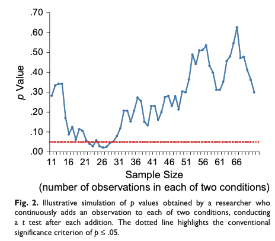

```{r setup, include=FALSE}
# R options
options(
  htmltools.dir.version = FALSE, # for blogdown
  show.signif.stars = FALSE,     # for regression output
  warm = 1,
  crayon.enabled = FALSE
  )
# Set dpi and height for images
library(knitr)
opts_chunk$set(fig.height = 2.65, dpi =300, warning=FALSE, message=FALSE) 
# ggplot2 color palette with gray
color_palette <- list(gray = "#999999", 
                      salmon = "#E69F00", 
                      lightblue = "#56B4E9", 
                      green = "#009E73", 
                      yellow = "#F0E442", 
                      darkblue = "#0072B2", 
                      red = "#D55E00", 
                      purple = "#CC79A7")

library(tidyverse)
library(gridExtra)
htmltools::tagList(rmarkdown::html_dependency_font_awesome())
### xaringan::inf_mr() -> use this for display within Rstudio

xaringanExtra::use_share_again()
xaringanExtra::style_share_again(
  share_buttons = "none"
)

htmltools::tagList(
  xaringanExtra::use_clipboard(
    button_text = "<i class=\"fa fa-clipboard\"></i>",
    success_text = "<i class=\"fa fa-check\" style=\"color: #90BE6D\"></i>",
    error_text = "<i class=\"fa fa-times-circle\" style=\"color: #F94144\"></i>"
  ),
  rmarkdown::html_dependency_font_awesome()
)
```

## Example answers to question 1

```{r include=FALSE}
pa1 <- pwr::pwr.t.test(
  d = 2/4.78, sig.level = 0.05, 
  power = 0.8, type = "two.sample")
pa1
```

.small[

.pull-left[

__Assumptions.__ Suppose the researchers wanted at least 80% statistical power to capture a difference of 2 pg/ml or more. That is, they wanted to ensure that if there was in deed a true difference of 2 pg/ml between the two groups then the experiment would detect and conclude a significant difference with a probability of 80%. Futher assume the observed standard deviation is a good estimate for the true standard deviation.

__Power analysis.__ Using at 5% significance level, we can conduct a power analysis to compute the required sample size in R as shown on the right. Based on the result, it's recommended to recruit at least `r ceiling(pa1$n)` participants per treatment, or `r ceiling(pa1$n) * 2` in total. 

]

.pull-right[

```{r}
pwr::pwr.t.test(
  d = 2/4.78, sig.level = 0.05, 
  power = 0.8, type = "two.sample")
```

]
]

---
## Example answers to question 2

.small[

.pull-left[

__Short answer.__ A statistically significant result with a small sample does not imply the same conclusion with a larger sample.

__Explanation.__ It's easy to assume that you would find significant results with a larger sample if you found a significant result with a smaller sample. However, a smaller sample also means a larger standard error which increases the likelihood of observing unusual values. That is, the significant result from a smaller sample can be a result of randomness and you may not observe the same result with a larger sample. Simmons, Nelson,, and Simonsohn demonstrated this with a simulation shown on the right.

]

.pull-right[

```{r echo=FALSE, out.width="80%"}

```

.tiny[Figure 2 from False-positive psychology: Undisclosed flexibility in data collection and analysis allows presenting anything as significant by Simmons, Nelson, and Simonsohn. 2011.  https://journals.sagepub.com/doi/full/10.1177/0956797611417632]

]
]


---
## Example answers to question 3

```{r include=FALSE}
pa3 <- pwr::pwr.t.test(
  d = 5/4.78, sig.level = 0.05, 
  power = 0.8, type = "two.sample")
```

.small[
.pull-left[

We can repeat the calculation using 5 pg/ml instead of 2 pg ml for the desired effect size. The same R function now indicates a minimum sample size of `r ceiling(pa3$n) * 2`. When you expect a bigger difference, it's easier to detect the difference and requires smaller sample to achieve the same statistical power.

]

.pull-right[

```{r}
pwr::pwr.t.test(
  d = 5/4.78, sig.level = 0.05, 
  power = 0.8, type = "two.sample")
```

]
]

```{r eval = FALSE, echo = FALSE}

pagedown::chrome_print("HMBxSTA.html", wait = 10)

```
